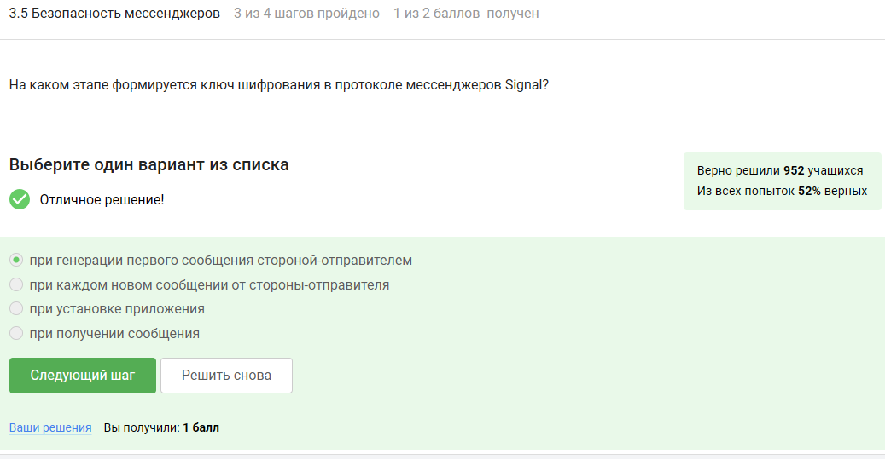

---
## Front matter
lang: ru-RU
title: Внешний курс. Блок 2. Защита ПК/телефона
subtitle: Основы информационной безопасности
author:
  - Мурашов И. В., НКАбд-03-23
institute:
  - Российский университет дружбы народов, Москва, Россия
  
date: 17 мая 2025

## i18n babel
babel-lang: russian
babel-otherlangs: english

## Formatting pdf
toc: false
toc-title: Содержание
slide_level: 2
aspectratio: 169
section-titles: true
theme: metropolis
header-includes:
 - \metroset{progressbar=frametitle,sectionpage=progressbar,numbering=fraction}
 - '\makeatletter'
 - '\makeatother'
 
## Fonts
mainfont: PT Serif
romanfont: PT Serif
sansfont: PT Sans
monofont: PT Mono
mainfontoptions: Ligatures=TeX
romanfontoptions: Ligatures=TeX
sansfontoptions: Ligatures=TeX,Scale=MatchLowercase
monofontoptions: Scale=MatchLowercase,Scale=0.9
---

## Докладчик

:::::::::::::: {.columns align=center}
::: {.column width="70%"}

  * Мурашов Иван Вячеславович
  * Cтудент, 2 курс, группа НКАбд-03-23
  * Российский университет дружбы народов
  * [1132236018@rudn.ru](mailto:1132236018@rudn.ru)
  * <https://neve7mind.github.io>

:::
::: {.column width="30%"}

:::
::::::::::::::

## Цель работы

Выполнение контрольных заданий 2го блока внешнего курса "Основы Кибербезопасности".

## Шифрование диска

Шифрование  диска - технология защиты информации, которая переводит данные на диске в нечитаемый код. Само собой можно зашифровать загрузочный сектор диска.

## Шифрование диска

Шифрование диска основано на симметричном шифровании.

## Шифрование диска

Отмечены программы, с помощью которых можно зашифровать жетский диск.

## Пароли

Стойкий пароль - тот, который тяжлее подобрать, он должен быть со спец. символами и длинный.

## Пароли

Все варианты, кроме менеджера паролей, совершенно не надежные.

## Пароли

Капча нужна для проверки на то, что за экраном "не робот".

## Пароли

Опасно хранить пароли в открытом виде, поэтому хранят их хэши.

## Пароли

Соль не поможет.

## Пароли

Все приведенные меры защищают от утечек данных.

## Фишинг

Фишинговые ссылки очень похожи на ссылки известных сервисов, но с некоторыми отличиями.

## Фишинг

Да, может, например, если пользователя со знакомым адресом взломали.

## Вирусы. Примеры

Ответ дан в соответствии с определением.

## Вирусы. Примеры

Троян маскируется под обычную программу.

## Безопасность мессенджеров

При установке первого сообщения отправителем формируется ключ шифрования.

## Безопасность мессенджеров

Суть сквозного шифрования состоит в том, что сообзения передаются по узлам связи в зашифрованном виде.

## Выводы

Был пройден второй блок курса "Основы кибербезопасности", мной были изучены правила хранения паролей и основная информация о вирусах

