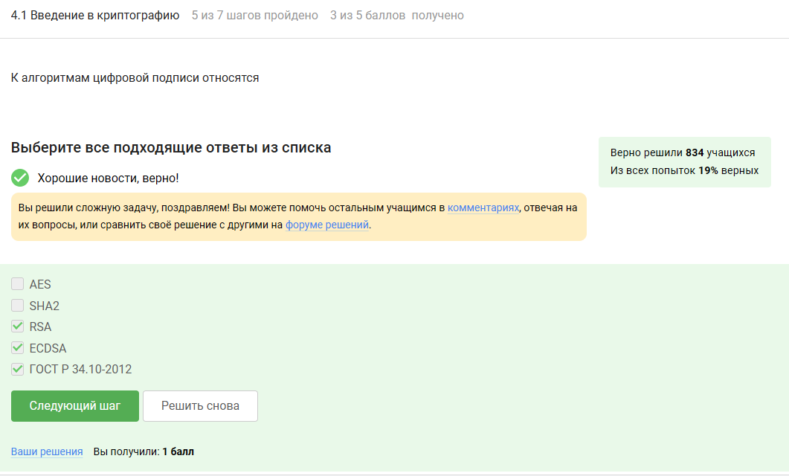

---
## Front matter
lang: ru-RU
title: Внешний курс. Блок 3. Криптография на практике
subtitle: Основы информационной безопасности
author:
  - Мурашов И. В., НКАбд-03-23
institute:
  - Российский университет дружбы народов, Москва, Россия
  
date: 17 мая 2025

## i18n babel
babel-lang: russian
babel-otherlangs: english

## Formatting pdf
toc: false
toc-title: Содержание
slide_level: 2
aspectratio: 169
section-titles: true
theme: metropolis
header-includes:
 - \metroset{progressbar=frametitle,sectionpage=progressbar,numbering=fraction}
 - '\makeatletter'
 - '\makeatother'
 
## Fonts
mainfont: PT Serif
romanfont: PT Serif
sansfont: PT Sans
monofont: PT Mono
mainfontoptions: Ligatures=TeX
romanfontoptions: Ligatures=TeX
sansfontoptions: Ligatures=TeX,Scale=MatchLowercase
monofontoptions: Scale=MatchLowercase,Scale=0.9
---

## Докладчик

:::::::::::::: {.columns align=center}
::: {.column width="70%"}

  * Мурашов Иван Вячеславович
  * Cтудент, 2 курс, группа НКАбд-03-23
  * Российский университет дружбы народов
  * [1132236018@rudn.ru](mailto:1132236018@rudn.ru)
  * <https://neve7mind.github.io>

:::
::: {.column width="30%"}

:::
::::::::::::::

## Цель работы

Выполнение контрольных заданий 3го блока внешнего курса "Основы Кибербезопасности".

## Введение в криптографию

Асимметричные криптографические системы подразумевают под собой то, что пара ключей есть у обоих сторон.

## Введение в криптографию

Отмечены основные условия для криптографической хэш-функции.

## Введение в криптографию

Отмечены алгоритмы цифровой подписи.

## Введение в криптографию

В информационной безопасности аутентификация сообщения или аутентификация источника данных-это свойство, которое гарантирует, что сообщение не было изменено во время передачи (целостность данных) и что принимающая сторона может проверить источник сообщения.

## Введение в криптографию

Определение обмена ключами Диффи-Хэллмана.

## Цифровая подпись

По определению цифровой подписи протокол ЭЦП относится к протоколам с публичным ключом.

## Цифровая подпись

лгоритм верификации электронной подписи состоит в следующем. На первом этапе получатель сообщения строит собственный вариант хэш-функции подписанного документа. На втором этапе происходит расшифровка хэш-функции, содержащейся в сообщении с помощью открытого ключа отправителя. На третьем этапе производится сравнение двух хэш- функций. Их совпадение гарантирует одновременно подлинность содержимого документа и его авторства.

## Цифровая подпись

Электронная подпись обеспечивает все указанное, кроме конфиденциальности.

## Цифровая подпись

Для отправки налоговой отчетности в ФНС используется усиленная квалифицированная электронная подпись.

## Цифровая подпись

Верный ответ укзаан на изображении.

## Электронные платежи

Известные платежные системы - Visa, MasterCard, МИР.

## Электронные платежи

Верный ответ на изображении.

## Электронные платежи

При онлайн платежах используется многофакторная аутентификация.

## Блокчейн

Proof-of-Work, или PoW, (доказательство выполнения работы) — это алгоритм достижения консенсуса в блокчейне; он используется для подтверждения транзакций и создания новых блоков. С помощью PoW майнеры конкурируют друг с другом за завершение транзакций в сети и за вознаграждение.
Пользователи сети отправляют друг другу цифровые токены, после чего все транзакции собираются в блоки и записываются в распределенный реестр, то есть в блокчейн.

## Блокчейн

Консенсус блокчейна — это процедура, в ходе которой участники сети достигают согласия о текущем состоянии данных в сети. Благодаря этому алгоритмы консенсуса устанавливают надежность и доверие к самоу сети.

## Блокчейн

Ответ - цифровая подпись.

## Выводы

Был пройден третий блок курса "Основы кибербезопасности", мной были изучены такие понятия как цифровая подпись, электронные платежи и блокчейн.

