---
## Front matter
lang: ru-RU
title: Лабораторная работа №1
subtitle: Основы информационной безопасности
author:
  - Мурашов И. В., НКАбд-03-23
institute:
  - Российский университет дружбы народов, Москва, Россия
  
date: 22 февраля 2025

## i18n babel
babel-lang: russian
babel-otherlangs: english

## Formatting pdf
toc: false
toc-title: Содержание
slide_level: 2
aspectratio: 169
section-titles: true
theme: metropolis
header-includes:
 - \metroset{progressbar=frametitle,sectionpage=progressbar,numbering=fraction}
 - '\makeatletter'
 - '\makeatother'
 
## Fonts
mainfont: PT Serif
romanfont: PT Serif
sansfont: PT Sans
monofont: PT Mono
mainfontoptions: Ligatures=TeX
romanfontoptions: Ligatures=TeX
sansfontoptions: Ligatures=TeX,Scale=MatchLowercase
monofontoptions: Scale=MatchLowercase,Scale=0.9
---

## Докладчик

:::::::::::::: {.columns align=center}
::: {.column width="70%"}

  * Мурашов Иван Вячеславович
  * Cтудент, 2 курс, группа НКАбд-03-23
  * Российский университет дружбы народов
  * [1132236018@rudn.ru](mailto:1132236018@rudn.ru)
  * <https://neve7mind.github.io>

:::
::: {.column width="30%"}

:::
::::::::::::::

## Цель работы

Целью данной работы является приобретение практических навыков установки операционной системы на виртуальную машину, настройки минимально необходимых для дальнейшей работы сервисов.

## Выполнение лабораторной работы

Создаю новую виртуальную машину в Oracle VMBox.

## Выполнение лабораторной работы

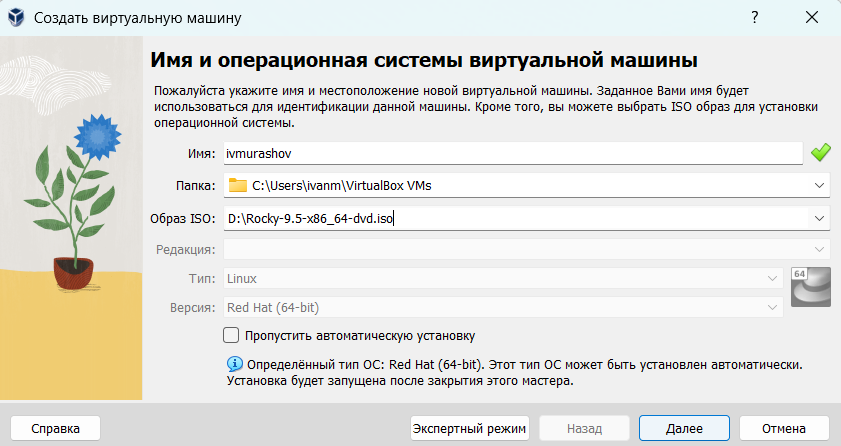

## Выполнение лабораторной работы

Выставляю размер основной памяти 5120 Мб и 5 ядер процессора.

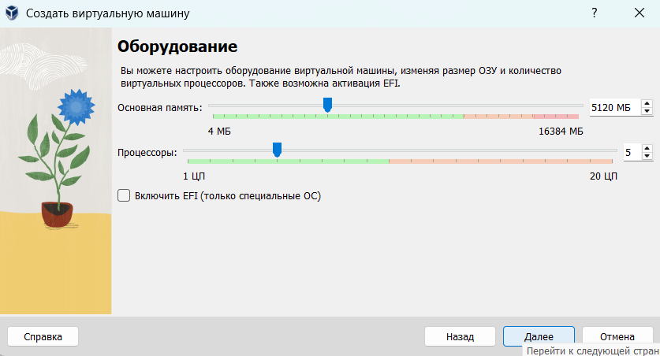

## Выполнение лабораторной работы

Устанавливаю ползователя и пароль.

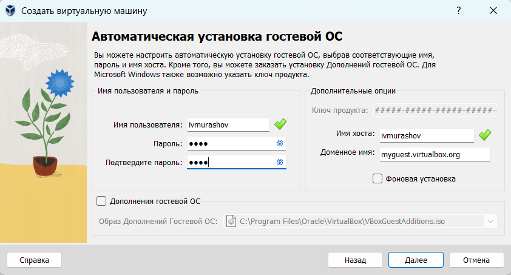

## Выполнение лабораторной работы

Выделяю 40 Гб на диск.

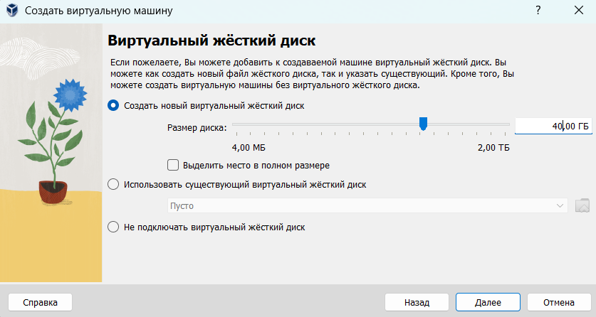

## Выполнение лабораторной работы

Просматриваю корректность данных.

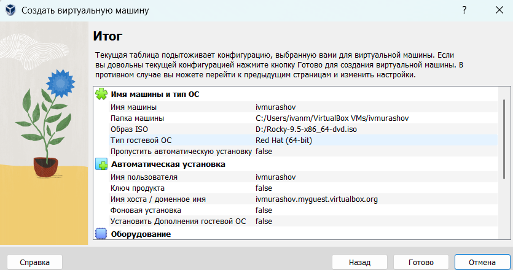

## Выполнение лабораторной работы

Выставляю 40 Мб на видеопамять.

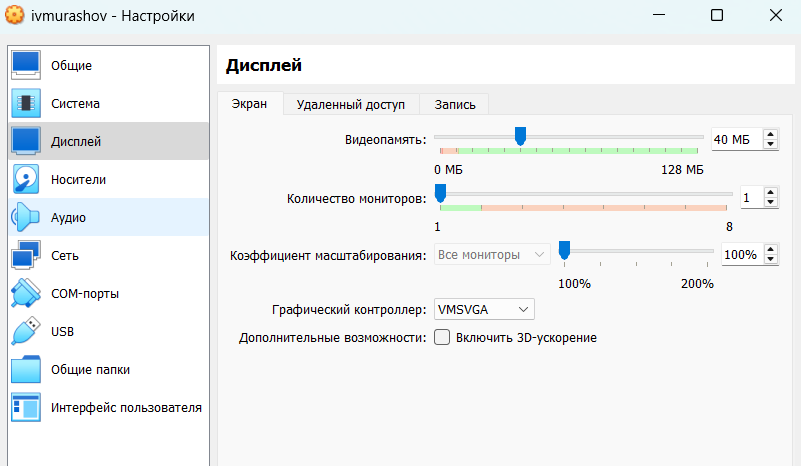

## Выполнение лабораторной работы

Выбираю язык установки.

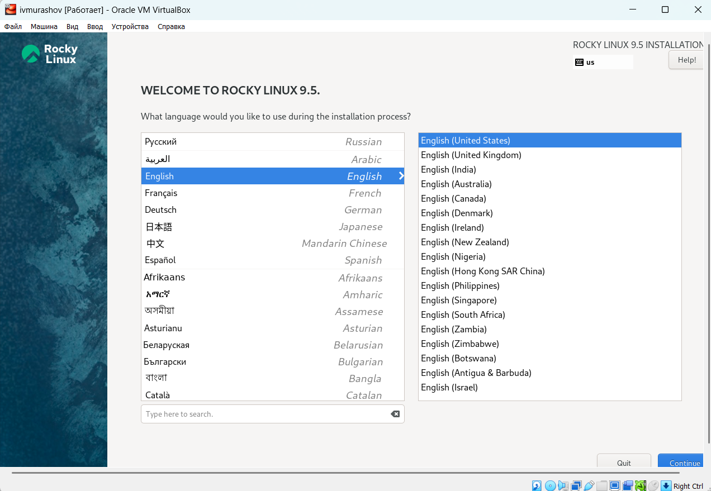

## Выполнение лабораторной работы

Выставляю правильные настройки: добавляю русскую раскладку, часовой пояс Москва, пароль для user и root, выбираю созданный ранее виртуальный диск, отключаю KDUMP, устанавливаю имя локальной сети.

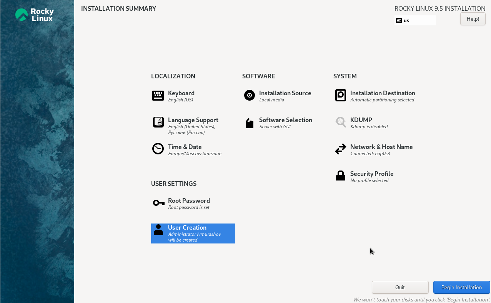

## Выполнение лабораторной работы

Подключаю образ гостевой ОС.

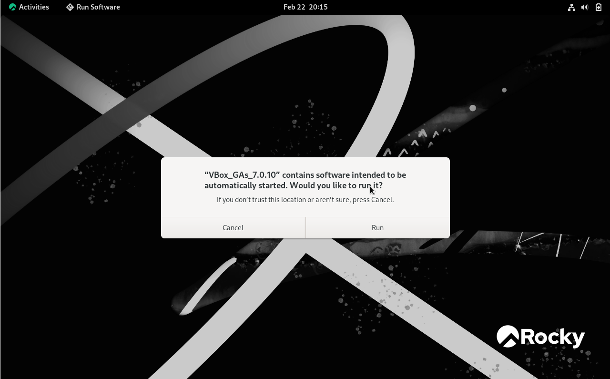

## Выполнение лабораторной работы

Проверяю, что имя хоста было установлено корректно.

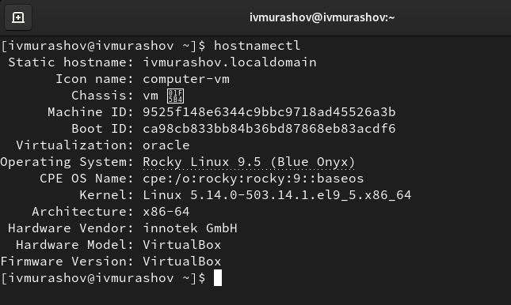

## Выполнение лабораторной работы

В окне терминала проверяем последовательность загрузки системы, выполнив команду dmesg | less.

Используем поиск с помощью grep:
dmesg | grep -i "то, что ищем"
Получаем следующую информацию.

1. Версия ядра Linux (Linux version).
2. Частота процессора (Detected Mhz processor).
3. Модель процессора (CPU0).
4. Объем доступной оперативной памяти (Memory available).
5. Тип обнаруженного гипервизора (Hypervisor detected).
6. Тип файловой системы корневого раздела.

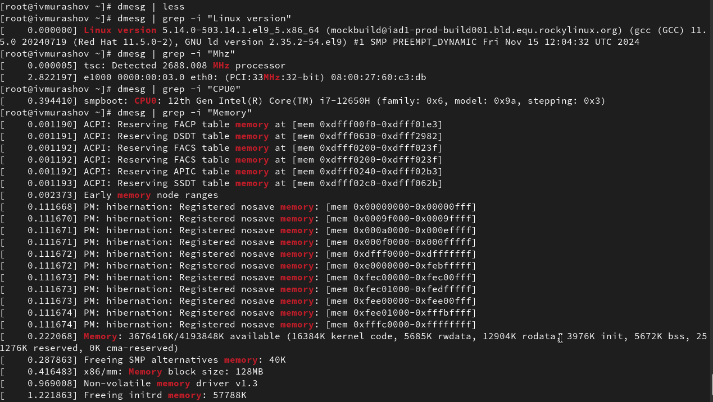

## Выполнение лабораторной работы

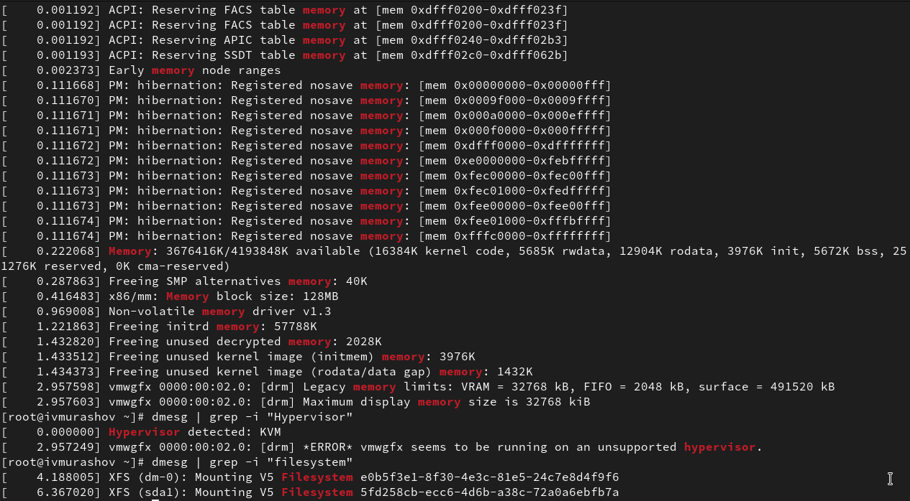

## Выводы

В ходе данной лабораторной работы я приобрёл практические навыки установки операционной системы на виртуальную машину, настройки минимально необходимых для дальнейшей работы сервисов.

