---
## Front matter
title: "Отчёт по лабораторной работе №1"
subtitle: "Основы информационной безопасности"
author: "Мурашов Иван Вячеславович"

## Generic otions
lang: ru-RU
toc-title: "Содержание"

## Bibliography
bibliography: bib/cite.bib
csl: pandoc/csl/gost-r-7-0-5-2008-numeric.csl

## Pdf output format
toc: true # Table of contents
toc-depth: 2
lof: true # List of figures
lot: true # List of tables
fontsize: 12pt
linestretch: 1.5
papersize: a4
documentclass: scrreprt
## I18n polyglossia
polyglossia-lang:
  name: russian
  options:
	- spelling=modern
	- babelshorthands=true
polyglossia-otherlangs:
  name: english
## I18n babel
babel-lang: russian
babel-otherlangs: english
## Fonts
mainfont: PT Serif
romanfont: PT Serif
sansfont: PT Sans
monofont: PT Mono
mainfontoptions: Ligatures=TeX
romanfontoptions: Ligatures=TeX
sansfontoptions: Ligatures=TeX,Scale=MatchLowercase
monofontoptions: Scale=MatchLowercase,Scale=0.9
## Biblatex
biblatex: true
biblio-style: "gost-numeric"
biblatexoptions:
  - parentracker=true
  - backend=biber
  - hyperref=auto
  - language=auto
  - autolang=other*
  - citestyle=gost-numeric
## Pandoc-crossref LaTeX customization
figureTitle: "Рис."
tableTitle: "Таблица"
listingTitle: "Листинг"
lofTitle: "Список иллюстраций"
lotTitle: "Список таблиц"
lolTitle: "Листинги"
## Misc options
indent: true
header-includes:
  - \usepackage{indentfirst}
  - \usepackage{float} # keep figures where there are in the text
  - \floatplacement{figure}{H} # keep figures where there are in the text
---

# Цель работы

Целью данной работы является приобретение практических навыков установки операционной системы на виртуальную машину, настройки минимально необходимых для дальнейшей работы сервисов.

# Задание

1. Установка и настройка системы
2. Получить следующую информацию:
	1. Версия ядра Linux (Linux version).
	2. Частота процессора (Detected Mhz processor).
	3. Модель процессора (CPU0).
	4. Объем доступной оперативной памяти (Memory available).
	5. Тип обнаруженного гипервизора (Hypervisor detected).
	6. Тип файловой системы корневого раздела.
	7. Последовательность монтирования файловых систем.

# Выполнение лабораторной работы

Создаю новую виртуальную машину в Oracle VMBox (рис. [-@fig:001]).

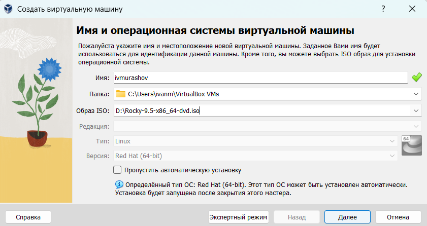{#fig:001 width=70%}

Выставляю размер основной памяти 5120 Мб и 5 ядер процессора (рис. [-@fig:002]).

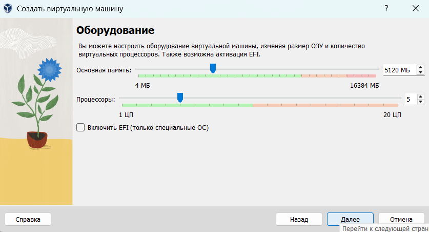{#fig:002 width=70%}

Устанавливаю ползователя и пароль (рис. [-@fig:003]).

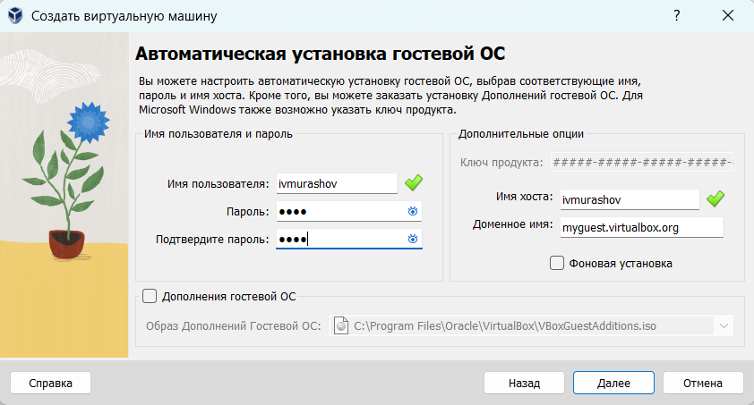{#fig:003 width=70%}

Выделяю 40 Гб на диск (рис. [-@fig:004]).

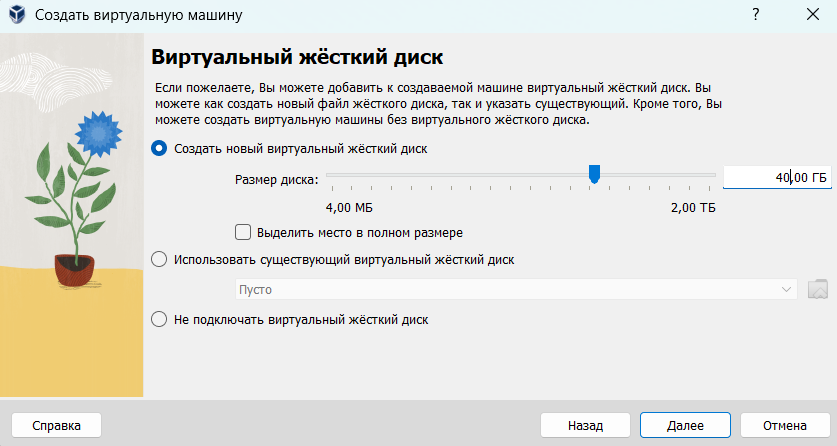{#fig:004 width=70%}

Просматриваю корректность данных (рис. [-@fig:005]).

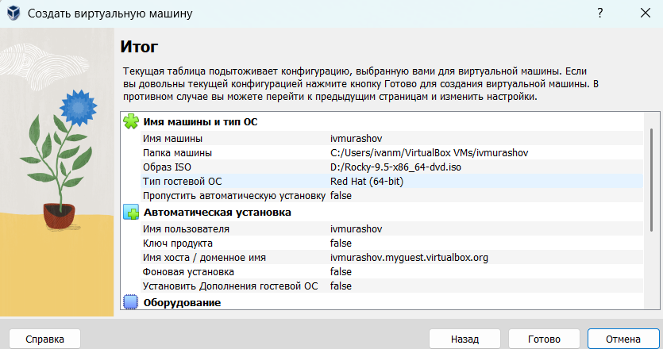{#fig:005 width=70%}

Выставляю 40 Мб на видеопамять (рис. [-@fig:006]).

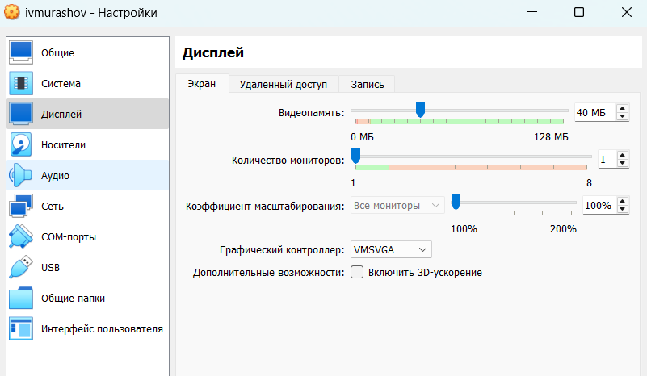{#fig:006 width=70%}

Выбираю язык установки (рис. [-@fig:007]).

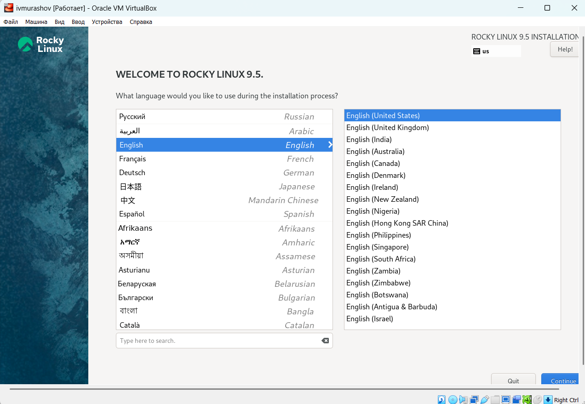{#fig:007 width=70%}

Выставляю правильные настройки: добавляю русскую раскладку, часовой пояс Москва, пароль для user и root, выбираю созданный ранее виртуальный диск, отключаю KDUMP, устанавливаю имя локальной сети (рис. [-@fig:008]).

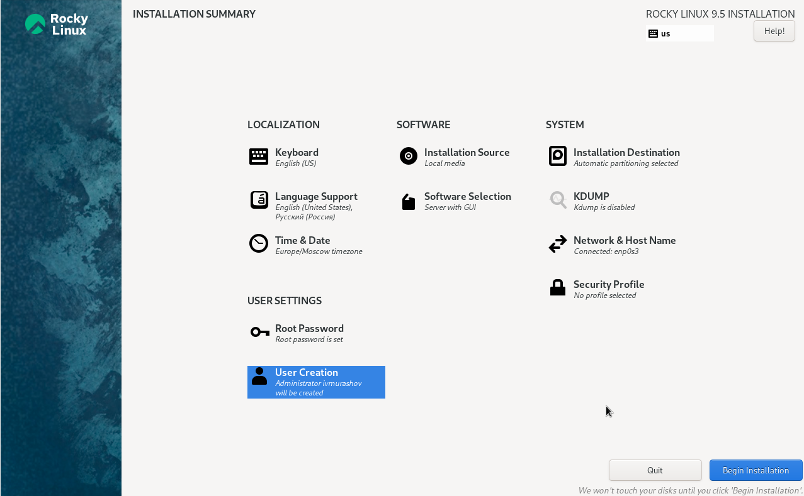{#fig:008 width=70%}

Подключаю образ гостевой ОС (рис. [-@fig:009]).

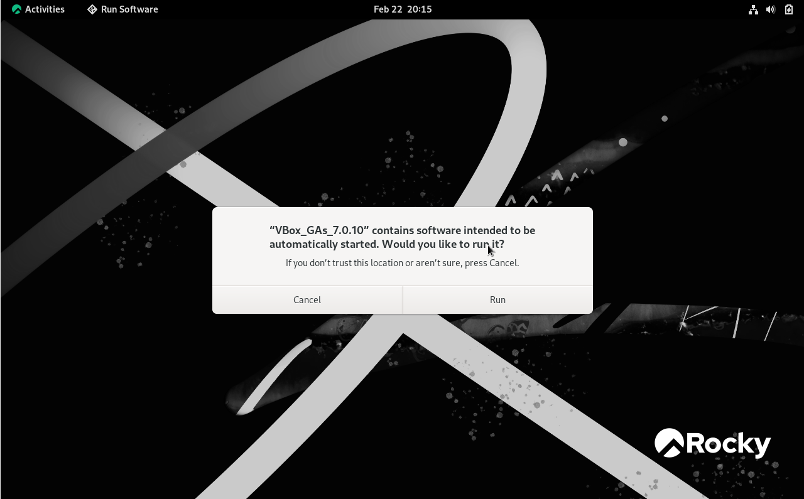{#fig:009 width=70%}

Проверяю, что имя хоста было установлено корректно (рис. [-@fig:010]).

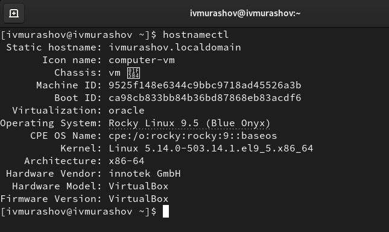{#fig:010 width=70%}

# Домашнее задание

В окне терминала проверяем последовательность загрузки системы, выполнив команду dmesg | less.

Используем поиск с помощью grep:
dmesg | grep -i "то, что ищем"
Получаем следующую информацию (рис. [-@fig:011]), (рис. [-@fig:012])

1. Версия ядра Linux (Linux version).
2. Частота процессора (Detected Mhz processor).
3. Модель процессора (CPU0).
4. Объем доступной оперативной памяти (Memory available).
5. Тип обнаруженного гипервизора (Hypervisor detected).
6. Тип файловой системы корневого раздела.

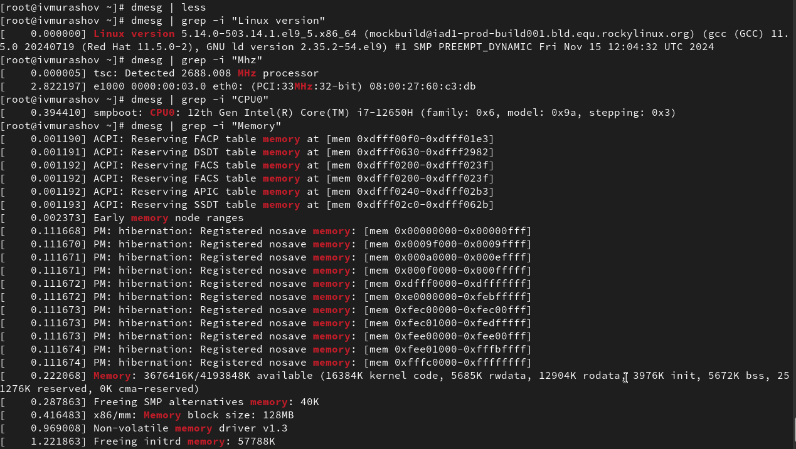{#fig:011 width=70%}

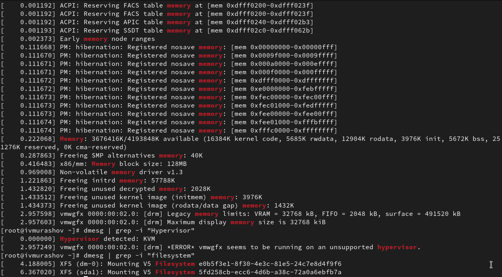{#fig:012 width=70%}

# Контрольные вопросы

1. Какую информацию содержит учётная запись пользователя?

Совокупность данных о пользователе, необходимая для его опознавания (аутентификации) и предоставления доступа к его личным данным и настройкам. 
Учётная запись, как правило, содержит сведения, необходимые для опознания пользователя при подключении к системе, сведения для авторизации и учёта. Это идентификатор пользователя (login) и его пароль. Пароль или его аналог, как правило, хранится в зашифрованном или хэшированном виде для обеспечения его безопасности.

2. Укажите команды терминала и приведите примеры:
  
- для получения справки по команде: команда `man`;
- для перемещения по файловой системе: команда `cd` ;
- для просмотра содержимого каталога: команда `ls`;
- для определения объёма каталога: команда `du`;
- для создания / удаления каталогов / файлов: команда `mkdir`/ команда `rm -r`/ команда `rm`;
- для задания определённых прав на файл / каталог: команда `chmod`;
- для просмотра истории команд: команда `history`.

3. Что такое файловая система? Приведите примеры с краткой характеристикой.

Файловая система — это метод управления файлами и папками на пользовательских устройствах хранения, таких как жёсткие диски, флеш-накопители и другие носители данных.

- FAT -- одна из самых старых файловых систем, разработанная для использования в операционных системах MS-DOS и Windows.

- NTFS -- файловая система, разработанная компанией Microsoft и используемая в операционных системах Windows NT и последующих версиях Windows.

- ext4 -- файловая система, используемая в операционных системах Linux.

4. Как посмотреть, какие файловые системы подмонтированы в ОС?

df (аббревиатура от disk free) — утилита в UNIX и UNIX-подобных системах.

Она показывает список всех файловых систем по именам устройств, сообщает их размер, занятое и свободное пространство и точки монтирования.

Утилиту df можно использовать для получения информации о том, к какой файловой системе относится какой-либо каталог.

5. Как удалить зависший процесс?

Чтобы удалить зависший процесс в Linux, можно использовать следующие команды:

Команда kill принимает в качестве параметра PID процесса и отправляет сигнал процессу. По умолчанию посылается сигнал SIGTERM.

Команда killall предназначена для «убийства» всех процессов, имеющих одно и то же имя.

# Выводы

В ходе данной лабораторной работы я приобрёл практические навыки установки операционной системы на виртуальную машину, настройки минимально необходимых для дальнейшей работы сервисов.

