---
## Front matter
lang: ru-RU
title: Лабораторная работа №2
subtitle: Основы информационной безопасности
author:
  - Мурашов И. В., НКАбд-03-23
institute:
  - Российский университет дружбы народов, Москва, Россия
  
date: 7 марта 2025

## i18n babel
babel-lang: russian
babel-otherlangs: english

## Formatting pdf
toc: false
toc-title: Содержание
slide_level: 2
aspectratio: 169
section-titles: true
theme: metropolis
header-includes:
 - \metroset{progressbar=frametitle,sectionpage=progressbar,numbering=fraction}
 - '\makeatletter'
 - '\makeatother'
 
## Fonts
mainfont: PT Serif
romanfont: PT Serif
sansfont: PT Sans
monofont: PT Mono
mainfontoptions: Ligatures=TeX
romanfontoptions: Ligatures=TeX
sansfontoptions: Ligatures=TeX,Scale=MatchLowercase
monofontoptions: Scale=MatchLowercase,Scale=0.9
---

## Докладчик

:::::::::::::: {.columns align=center}
::: {.column width="70%"}

  * Мурашов Иван Вячеславович
  * Cтудент, 2 курс, группа НКАбд-03-23
  * Российский университет дружбы народов
  * [1132236018@rudn.ru](mailto:1132236018@rudn.ru)
  * <https://neve7mind.github.io>

:::
::: {.column width="30%"}

:::
::::::::::::::

## Цель работы

Целью данной работы является приобретение практических навыков работы в консоли с атрибутами файлов, закрепление теоретических основ дискреционного разграничения доступа в современных системах с открытым кодом на базе ОС Linux.

## Выполнение лабораторной работы

1. В операционной системе Rocky создаю нового пользователя guest через учетную запись администратора.

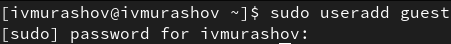

## Выполнение лабораторной работы

2. Далее задаю пароль для созданной учетной записи.

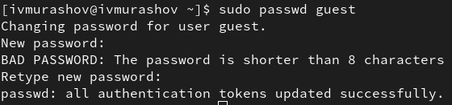

## Выполнение лабораторной работы

3. Сменяю пользователя в системе на только что созданного пользователя guest.

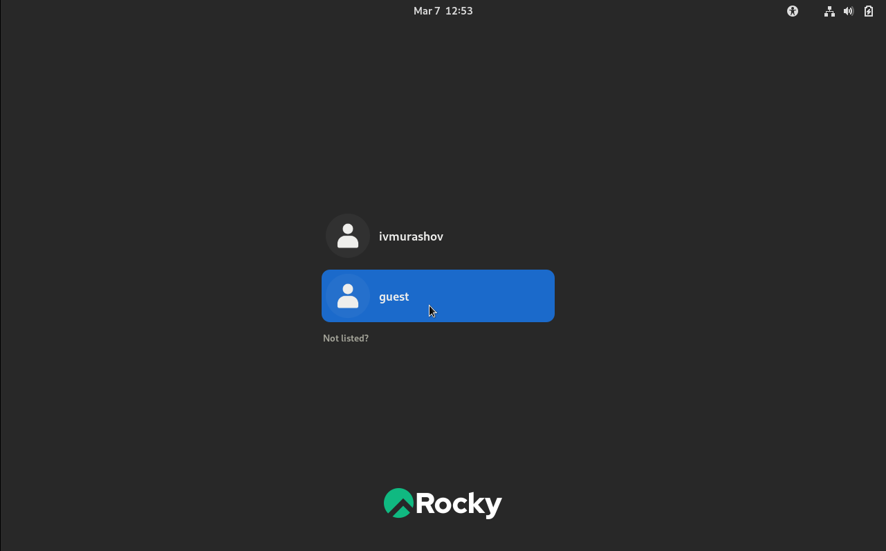

## Выполнение лабораторной работы

4. Определяю с помощью команды pwd, что я нахожусь в директории /home/guest/. Эта директория является домашней, ведь в приглашении командой строкой стоит значок ~, указывающий, что я в домашней директории.

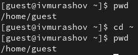

## Выполнение лабораторной работы

5. Уточняю имя пользователя.

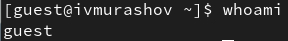

## Выполнение лабораторной работы

6. В выводе команды groups информация только о названии группы, к которой относится пользователь. В выводе команды id можно найти больше информации: имя пользователя и имя группы, также коды имени пользователя и группы.

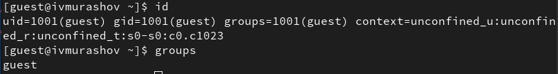

## Выполнение лабораторной работы

7. Имя пользователя в приглашении командной строкой совпадает с именем пользователя, которое выводит команда whoami.


## Выполнение лабораторной работы

8. Получаю информацию о пользователе с помощью команды 
```
cat /etc/passwd | grep guest
```

В выводе получаю коды пользователя и группы, адрес домашней директории.

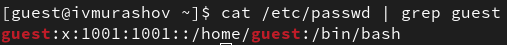

## Выполнение лабораторной работы

9. Да, список поддиректорий директории home получилось получить с помощью команды ls -l, если мы добавим опцию -a, то сможем увидеть еще и директорию пользователя root. Права у директории:

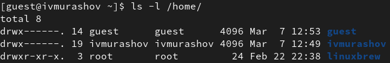

## Выполнение лабораторной работы

10. Пытался проверить расширенные атрибуты директорий. Нет, их увидеть не удалось. Увидеть расширенные атрибуты других пользователей, тоже не удалось, для них даже вывода списка директорий не было.

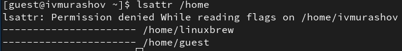

## Выполнение лабораторной работы

11. Создаю поддиректорию dir1 для домашней директории. Расширенные атрибуты командой lsattr просмотреть у директории не удается, но атрибуты есть: drwxr-xr-x, их удалось просмотреть с помощью команды ls -l.

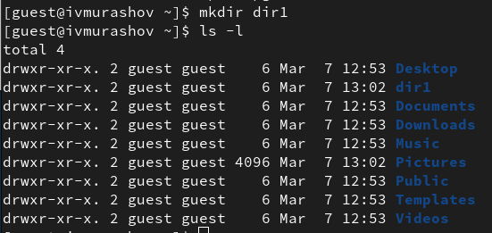

## Выполнение лабораторной работы

12. Снимаю атрибуты командой chmod 000 dir1, при проверке с помощью команды ls -l видно, что теперь атрибуты действительно сняты.

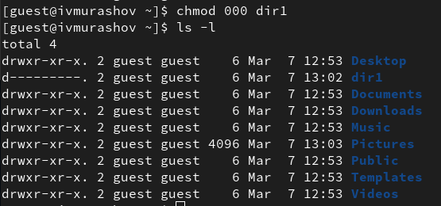

## Выполнение лабораторной работы

13. Попытка создать файл в директории dir1. Выдает ошибку: "Отказано в доступе".

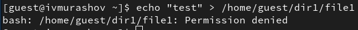

## Выполнение лабораторной работы

Вернув права директории и использовав снова командy ls -l можно убедиться, что файл не был создан.

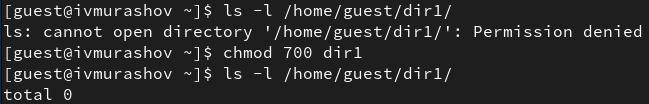

## Заполнение таблицы 2.1

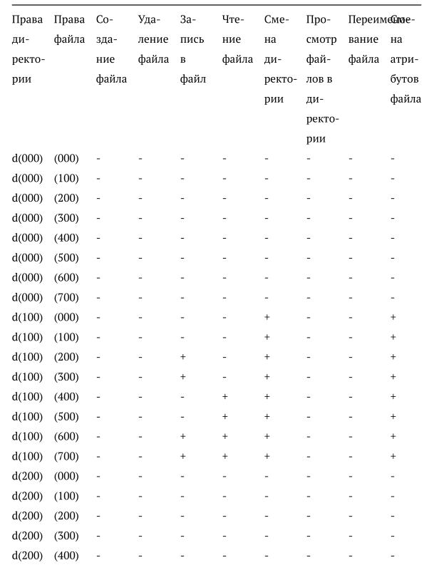

## Заполнение таблицы 2.1

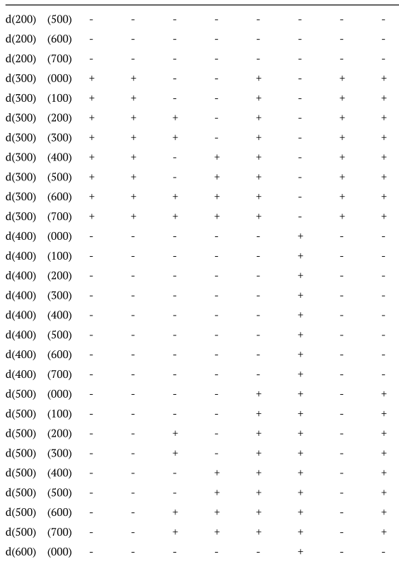

## Заполнение таблицы 2.1

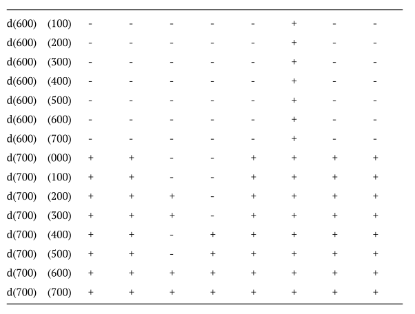

Таблица 2.1 «Установленные права и разрешённые действия»

## Выполнение лабораторной работы

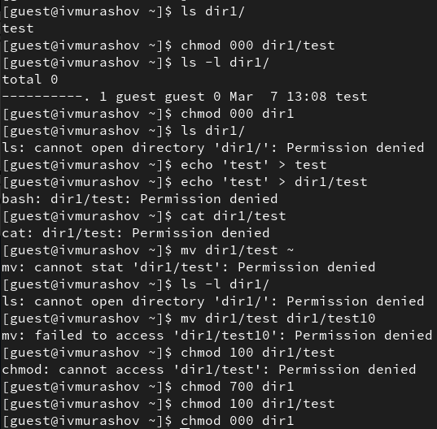

## Заполнение таблицы 2.2

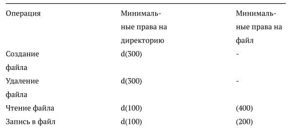

## Заполнение таблицы 2.2

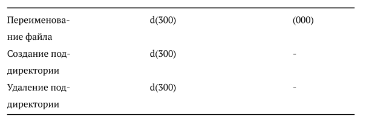

Таблица 2.2 "Минимальные права для совершения операций"

## Выполнение лабораторной работы

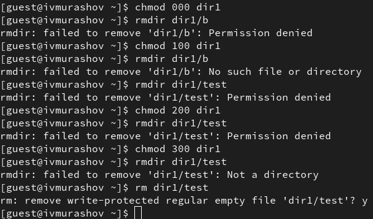

## Выводы

В ходе данной лабораторной работы я приобрёл практические навыки работы в консоли с атрибутами файлов, закрепил теоретические основы дискреционного разграничения доступа в современных системах с открытым кодом на базе ОС Linux.

