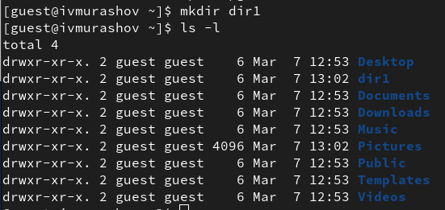

---
## Front matter
title: "Отчёт по лабораторной работе №2"
subtitle: "Основы информационной безопасности"
author: "Мурашов Иван Вячеславович"

## Generic otions
lang: ru-RU
toc-title: "Содержание"

## Bibliography
bibliography: bib/cite.bib
csl: pandoc/csl/gost-r-7-0-5-2008-numeric.csl

## Pdf output format
toc: true # Table of contents
toc-depth: 2
lof: true # List of figures
lot: true # List of tables
fontsize: 12pt
linestretch: 1.5
papersize: a4
documentclass: scrreprt
## I18n polyglossia
polyglossia-lang:
  name: russian
  options:
	- spelling=modern
	- babelshorthands=true
polyglossia-otherlangs:
  name: english
## I18n babel
babel-lang: russian
babel-otherlangs: english
## Fonts
mainfont: PT Serif
romanfont: PT Serif
sansfont: PT Sans
monofont: PT Mono
mainfontoptions: Ligatures=TeX
romanfontoptions: Ligatures=TeX
sansfontoptions: Ligatures=TeX,Scale=MatchLowercase
monofontoptions: Scale=MatchLowercase,Scale=0.9
## Biblatex
biblatex: true
biblio-style: "gost-numeric"
biblatexoptions:
  - parentracker=true
  - backend=biber
  - hyperref=auto
  - language=auto
  - autolang=other*
  - citestyle=gost-numeric
## Pandoc-crossref LaTeX customization
figureTitle: "Рис."
tableTitle: "Таблица"
listingTitle: "Листинг"
lofTitle: "Список иллюстраций"
lotTitle: "Список таблиц"
lolTitle: "Листинги"
## Misc options
indent: true
header-includes:
  - \usepackage{indentfirst}
  - \usepackage{float} # keep figures where there are in the text
  - \floatplacement{figure}{H} # keep figures where there are in the text
---

# Цель работы

Целью данной работы является приобретение практических навыков работы в консоли с атрибутами файлов, закрепление теоретических основ дискреционного разграничения доступа в современных системах с открытым кодом на базе ОС Linux.

# Задание

1. Работа с атрибутами файлов
2. Заполнение таблицы "Установленные права и разрешённые действия" (см. табл. 2.1)
3. Заполнение таблицы "Минимальные права для совершения операций" (см. табл. 2.2)

# Выполнение лабораторной работы

## Атрибуты файлов

1. В операционной системе Rocky создаю нового пользователя guest через учетную запись администратора (рис. [-@fig:001]).

{#fig:001 width=70%}

2. Далее задаю пароль для созданной учетной записи (рис. [-@fig:002]).

{#fig:002 width=70%}

3. Сменяю пользователя в системе на только что созданного пользователя guest (рис. [-@fig:003]).

{#fig:003 width=70%}

4. Определяю с помощью команды pwd, что я нахожусь в директории /home/guest/. Эта директория является домашней, ведь в приглашении командой строкой стоит значок ~, указывающий, что я в домашней директории (рис. [-@fig:004]).

{#fig:004 width=70%}

5. Уточняю имя пользователя (рис. [-@fig:005]).

{#fig:005 width=70%}

6. В выводе команды groups информация только о названии группы, к которой относится пользователь. В выводе команды id можно найти больше информации: имя пользователя и имя группы, также коды имени пользователя и группы (рис. [-@fig:006]).

{#fig:006 width=70%}

7. Имя пользователя в приглашении командной строкой совпадает с именем пользователя, которое выводит команда whoami (рис. [-@fig:007]).

{#fig:007 width=70%}

8. Получаю информацию о пользователе с помощью команды 
```
cat /etc/passwd | grep guest
```

В выводе получаю коды пользователя и группы, адрес домашней директории (рис. [-@fig:008]).

{#fig:008 width=70%}

9. Да, список поддиректорий директории home получилось получить с помощью команды ls -l, если мы добавим опцию -a, то сможем увидеть еще и директорию пользователя root. Права у директории: (рис. [-@fig:009]).

{#fig:009 width=70%}

10. Пытался проверить расширенные атрибуты директорий. Нет, их увидеть не удалось. Увидеть расширенные атрибуты других пользователей, тоже не удалось, для них даже вывода списка директорий не было (рис. [-@fig:010]).

{#fig:010 width=70%}

11. Создаю поддиректорию dir1 для домашней директории. Расширенные атрибуты командой lsattr просмотреть у директории не удается, но атрибуты есть: drwxr-xr-x, их удалось просмотреть с помощью команды ls -l (рис. [-@fig:011]).

{#fig:011 width=70%}

12. Снимаю атрибуты командой chmod 000 dir1, при проверке с помощью команды ls -l видно, что теперь атрибуты действительно сняты (рис. [-@fig:012]).
 
{#fig:012 width=70%}

13. Попытка создать файл в директории dir1. Выдает ошибку: "Отказано в доступе" (рис. [-@fig:013]).

{#fig:013 width=70%}

Вернув права директории и использовав снова командy ls -l можно убедиться, что файл не был создан (рис. [-@fig:014]).

{#fig:014 width=70%}

## Заполнение таблицы 2.1

| | | | | | | | | | |
|-|-|-|-|-|-|-|-|-|-|
|Права директории|Права  файла|Создание  файла|Удаление  файла|Запись  в файл|Чтение  файла|Смена  директории|Просмотр файлов в  директории|Переимено- вание файла|Смена  атрибутов  файла|
|d(000)|(000)| -| -| -| -| -| -| -| -|
|d(000)|(100)| -| -| -| -| -| -| -| -|
|d(000)|(200)| -| -| -| -| -| -| -| -|
|d(000)|(300)| -| -| -| -| -| -| -| -|
|d(000)|(400)| -| -| -| -| -| -| -| -|
|d(000)|(500)| -| -| -| -| -| -| -| -|
|d(000)|(600)| -| -| -| -| -| -| -| -|
|d(000)|(700)| -| -| -| -| -| -| -| -|
|d(100)|(000)| -| -| -| -|+| -| -|+|
|d(100)|(100)| -| -| -| -|+| -| -|+|
|d(100)|(200)| -| -|+| -|+| -| -|+|
|d(100)|(300)| -| -|+| -|+| -| -|+|
|d(100)|(400)| -| -|-|+|+| -| -|+|
|d(100)|(500)| -| -|-|+|+| -| -|+|
|d(100)|(600)| -| -|+|+|+| -| -|+|
|d(100)|(700)| -| -|+|+|+| -| -|+|
|d(200)|(000)| -| -|-|-|-| -| -|-|
|d(200)|(100)| -| -|-|-|-| -| -|-|
|d(200)|(200)| -| -|-|-|-| -| -|-|
|d(200)|(300)| -| -|-|-|-| -| -|-|
|d(200)|(400)| -| -|-|-|-| -| -|-|
|d(200)|(500)| -| -|-|-|-| -| -|-|
|d(200)|(600)| -| -|-|-|-| -| -|-|
|d(200)|(700)| -| -|-|-|-| -| -|-|
|d(300)|(000)|+|+|-|-|+| -|+|+|
|d(300)|(100)|+|+|-|-|+| -|+|+|
|d(300)|(200)|+|+|+|-|+| -|+|+|
|d(300)|(300)|+|+|+|-|+| -|+|+|
|d(300)|(400)|+|+|-|+|+| -|+|+|
|d(300)|(500)|+|+|-|+|+| -|+|+|
|d(300)|(600)|+|+|+|+|+| -|+|+|
|d(300)|(700)|+|+|+|+|+| -|+|+|
|d(400)|(000)|-|-|-|-|-|+|-|-|
|d(400)|(100)|-|-|-|-|-|+|-|-|
|d(400)|(200)|-|-|-|-|-|+|-|-|
|d(400)|(300)|-|-|-|-|-|+|-|-|
|d(400)|(400)|-|-|-|-|-|+|-|-|
|d(400)|(500)|-|-|-|-|-|+|-|-|
|d(400)|(600)|-|-|-|-|-|+|-|-|
|d(400)|(700)|-|-|-|-|-|+|-|-|
|d(500)|(000)|-|-|-|-|+|+|-|+|
|d(500)|(100)|-|-|-|-|+|+|-|+|
|d(500)|(200)|-|-|+|-|+|+|-|+|
|d(500)|(300)|-|-|+|-|+|+|-|+|
|d(500)|(400)|-|-|-|+|+|+|-|+|
|d(500)|(500)|-|-|-|+|+|+|-|+|
|d(500)|(600)|-|-|+|+|+|+|-|+|
|d(500)|(700)|-|-|+|+|+|+|-|+|
|d(600)|(000)|-|-|-|-|-|+|-|-|
|d(600)|(100)|-|-|-|-|-|+|-|-|
|d(600)|(200)|-|-|-|-|-|+|-|-|
|d(600)|(300)|-|-|-|-|-|+|-|-|
|d(600)|(400)|-|-|-|-|-|+|-|-|
|d(600)|(500)|-|-|-|-|-|+|-|-|
|d(600)|(600)|-|-|-|-|-|+|-|-|
|d(600)|(700)|-|-|-|-|-|+|-|-|
|d(700)|(000)|+|+|-|-|+|+|+|+|
|d(700)|(100)|+|+|-|-|+|+|+|+|
|d(700)|(200)|+|+|+|-|+|+|+|+|
|d(700)|(300)|+|+|+|-|+|+|+|+|
|d(700)|(400)|+|+|-|+|+|+|+|+|
|d(700)|(500)|+|+|-|+|+|+|+|+|
|d(700)|(600)|+|+|+|+|+|+|+|+|
|d(700)|(700)|+|+|+|+|+|+|+|+|

Таблица 2.1 «Установленные права и разрешённые действия»

{#fig:015 width=70%}


## Заполнение таблицы 2.2

| | | | | |
|-|-|-|-|-|
|Операция| |Минимальные  права на  директорию| |Минимальные  права на файл|
|Создание файла| |d(300)| |-|
|Удаление файла| |d(300)| |-|
|Чтение файла| |d(100)| |(400)|
|Запись в файл| |d(100)| |(200)|
|Переименование файла| |d(300)| |(000)|
|Создание поддиректории| |d(300)| |-|
|Удаление поддиректории| |d(300)| |-|

Таблица 2.2 "Минимальные права для совершения операций"

{#fig:016 width=70%}

# Выводы

В ходе данной лабораторной работы я приобрёл практические навыки работы в консоли с атрибутами файлов, закрепил теоретические основы дискреционного разграничения доступа в современных системах с открытым кодом на базе ОС Linux.

