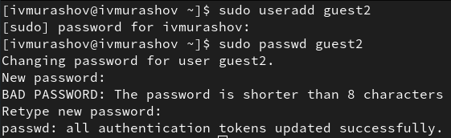
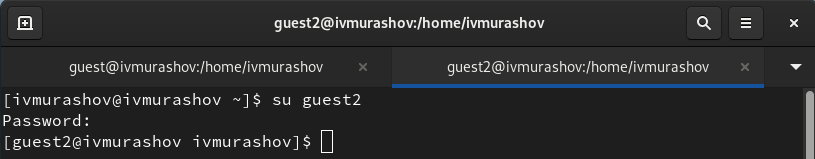
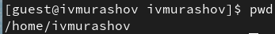
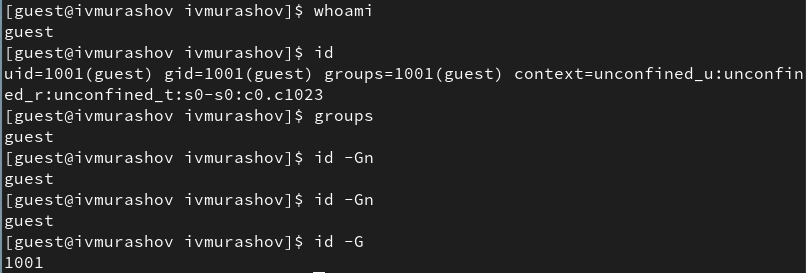
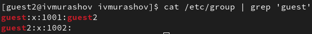

---
## Front matter
lang: ru-RU
title: Лабораторная работа №3
subtitle: Основы информационной безопасности
author:
  - Мурашов И. В., НКАбд-03-23
institute:
  - Российский университет дружбы народов, Москва, Россия
  
date: 22 марта 2025

## i18n babel
babel-lang: russian
babel-otherlangs: english

## Formatting pdf
toc: false
toc-title: Содержание
slide_level: 2
aspectratio: 169
section-titles: true
theme: metropolis
header-includes:
 - \metroset{progressbar=frametitle,sectionpage=progressbar,numbering=fraction}
 - '\makeatletter'
 - '\makeatother'
 
## Fonts
mainfont: PT Serif
romanfont: PT Serif
sansfont: PT Sans
monofont: PT Mono
mainfontoptions: Ligatures=TeX
romanfontoptions: Ligatures=TeX
sansfontoptions: Ligatures=TeX,Scale=MatchLowercase
monofontoptions: Scale=MatchLowercase,Scale=0.9
---

## Докладчик

:::::::::::::: {.columns align=center}
::: {.column width="70%"}

  * Мурашов Иван Вячеславович
  * Cтудент, 2 курс, группа НКАбд-03-23
  * Российский университет дружбы народов
  * [1132236018@rudn.ru](mailto:1132236018@rudn.ru)
  * <https://neve7mind.github.io>

:::
::: {.column width="30%"}

:::
::::::::::::::

## Цель работы

Целью данной работы является приобретение практических навыков работы в консоли с атрибутами файлов для групп пользователей.

## Выполнение лабораторной работы

1. Создаю пользователя guest2 с помощью комманды `useradd` и задаю ему пароль `passwd` (пользователь guest был создан во время выполнения 2ой лабораторной работы.



## Выполнение лабораторной работы

2. Добавляю пользователя guest2 в группу guest.


## Выполнение лабораторной работы

3. Захожу в guest и guest2 в консоли с помощью команды `su <имя пользователся>`.



## Выполнение лабораторной работы

4. Просматриваю путь директории, где я нахожусь на обоих аккаунтах.



## Выполнение лабораторной работы


## Выполнение лабораторной работы

5. Проверяю имя пользователя с помощью команды `whoami`, далее с помощью команды `id` просматриваю группы, к которым принадлежит пользователь, коды этих групп (`gid`), команда `groups` выводит список групп, в которые входит пользователь.



## Выполнение лабораторной работы


## Выполнение лабораторной работы

6. Получаю информацию о пользователях с помощью команды 

```
cat /etc/group | grep 'guest'
```

В выводе получаю коды пользователя и группы, адрес домашней директории.

{#fig:008 width=70%}

## Выполнение лабораторной работы

7. С помощью `newgrp` регистрирую нового пользователя в группе guest.


## Выполнение лабораторной работы

8. Добавляю права rwx группе пользователей guest.


## Выполнение лабораторной работы

9. Снимаю атрибуты командой chmod 000 dir1, при проверке с помощью команды ls -l видно, что теперь атрибуты действительно сняты.


## Выполнение лабораторной работы

## Заполнение таблицы 3.1

Проверяю, как guest2 взаимодействует с файлами директории dir1.


## Заполнение таблицы 3.1


## Заполнение таблицы 3.1


## Заполнение таблицы 3.1


## Заполнение таблицы 3.1


## Заполнение таблицы 3.1


## Заполнение таблицы 3.1


## Заполнение таблицы 3.1


Таблица 3.1 «Установленные права и разрешённые действия для групп»

## Заполнение таблицы 3.2


## Заполнение таблицы 3.2


## Заполнение таблицы 3.2


Таблица 3.2 «Минимальные права для совершения операций от имени пользователей входящих в группу»

## Выводы

В ходе данной лабораторной работы я приобрёл практические навыки работы в консоли с атрибутами файлов для групп пользователей.

