---
## Front matter
lang: ru-RU
title: Лабораторная работа №6
subtitle: Основы информационной безопасности
author:
  - Мурашов И. В., НКАбд-03-23
institute:
  - Российский университет дружбы народов, Москва, Россия
  
date: 3 мая 2025

## i18n babel
babel-lang: russian
babel-otherlangs: english

## Formatting pdf
toc: false
toc-title: Содержание
slide_level: 2
aspectratio: 169
section-titles: true
theme: metropolis
header-includes:
 - \metroset{progressbar=frametitle,sectionpage=progressbar,numbering=fraction}
 - '\makeatletter'
 - '\makeatother'
 
## Fonts
mainfont: PT Serif
romanfont: PT Serif
sansfont: PT Sans
monofont: PT Mono
mainfontoptions: Ligatures=TeX
romanfontoptions: Ligatures=TeX
sansfontoptions: Ligatures=TeX,Scale=MatchLowercase
monofontoptions: Scale=MatchLowercase,Scale=0.9
---

## Докладчик

:::::::::::::: {.columns align=center}
::: {.column width="70%"}

  * Мурашов Иван Вячеславович
  * Cтудент, 2 курс, группа НКАбд-03-23
  * Российский университет дружбы народов
  * [1132236018@rudn.ru](mailto:1132236018@rudn.ru)
  * <https://neve7mind.github.io>

:::
::: {.column width="30%"}

:::
::::::::::::::

## Цель

Развить навыки администрирования ОС Linux. Получить первое практическое знакомство с технологией SELinux1. Проверить работу SELinx на практике совместно с веб-сервером
Apache.

# Выполнение лабораторной работы

## Выполнение лабораторной работы

 SELinux работает в режиме enforcing политики targeted с помощью команд getenforce и sestatus

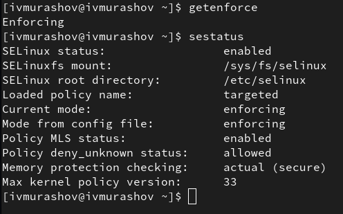{#fig:001 width=70%}

## Выполнение лабораторной работы

Запускаю сервер apache, далее обращаюсь с помощью браузера к веб-серверу, запущенному на компьютере, он работает, что видно из вывода команды `service httpd status`

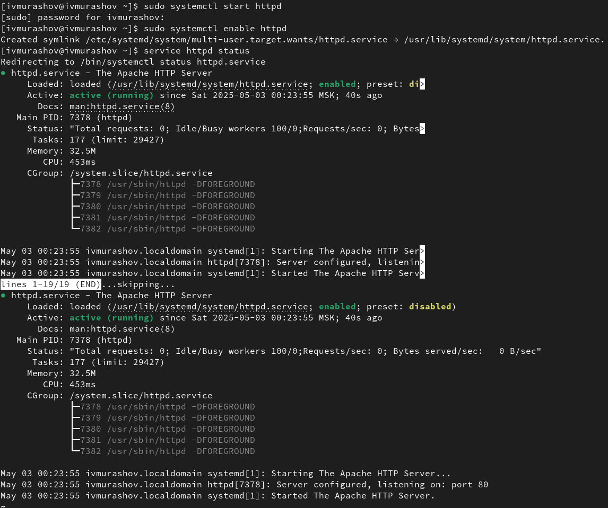{#fig:002 width=70%}

## Выполнение лабораторной работы

С помощью команды `ps auxZ | grep httpd` нахожу веб-сервер Apache в списке процессов. Его контекст
безопасности - httpd_t

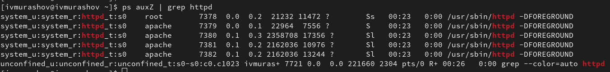{#fig:003 width=70%}

## Выполнение лабораторной работы

Просматриваю текущее состояние переключателей SELinux для Apache с помощью команды `sestatus -bigrep httpd` 

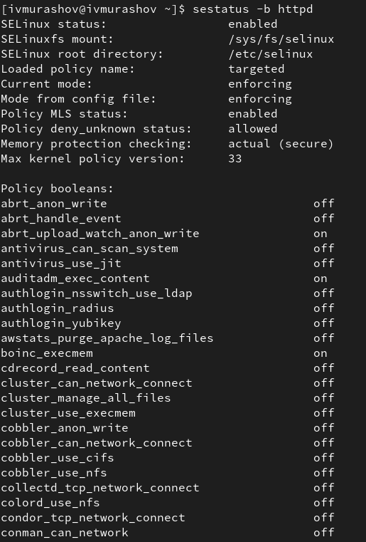{#fig:004 width=70%}

## Выполнение лабораторной работы

Просматриваю статистику по политике с помощью команды `seinfo`. Множество пользователей - 8, ролей - 39, типов - 5135. 

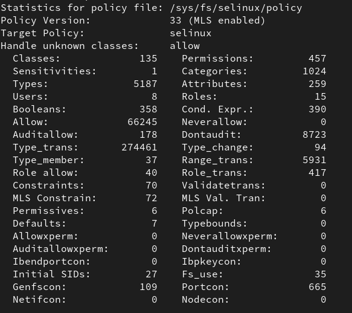{#fig:005 width=70%}

## Выполнение лабораторной работы

Типы поддиректорий, находящихся в директории `/var/www`, с помощью команды `ls -lZ /var/www` следующие: владелец - root, права на изменения только у владельца. Файлов в директории нет 

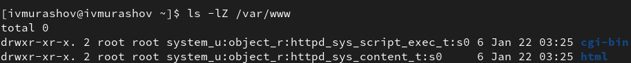{#fig:006 width=70%}

## Выполнение лабораторной работы

Создать файл может только суперпользователь, поэтому от его имени создаём файл touch.html cо следующим содержанием:

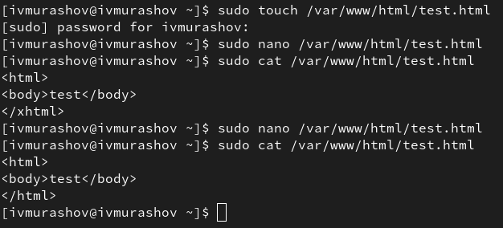{#fig:008 width=70%}

## Выполнение лабораторной работы

Проверяю контекст созданного файла. По умолчанию это httpd_sys_content_t 

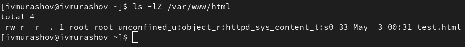{#fig:009 width=70%}

## Выполнение лабораторной работы

Обращаюсь к файлу через веб-сервер, введя в браузере адрес http://127.0.0.1/test.html. Файл был успешно отображён 

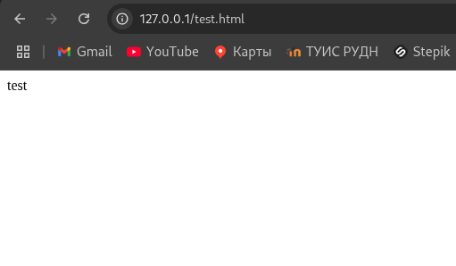{#fig:010 width=70%}

## Выполнение лабораторной работы

Изменяю контекст файла `/var/www/html/test.html` с
`httpd_sys_content_t` на любой другой, к которому процесс httpd не
должен иметь доступа, например, `на samba_share_t`:
`chcon -t samba_share_t /var/www/html/test.html`
`ls -Z /var/www/html/test.html`
Контекст действительно поменялся 

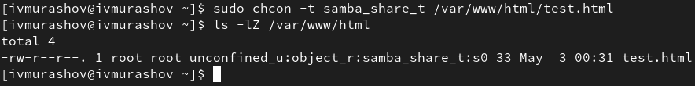{#fig:012 width=70%}

## Выполнение лабораторной работы

При попытке отображения файла в браузере получаем сообщение об ошибке 
файл не был отображён, хотя права
доступа позволяют читать этот файл любому пользователю, потому что установлен контекст, к которому процесс httpd не должен иметь доступа.

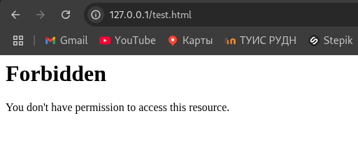{#fig:013 width=70%}

## Вывод

В ходе выполнения данной лабораторной работы были развиты навыки администрирования ОС Linux, получено первое практическое знакомство с технологией SELinux и проверена работа SELinux на практике совместно с веб-сервером
Apache.

