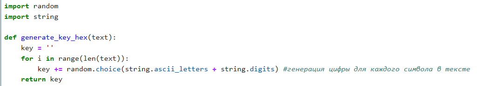
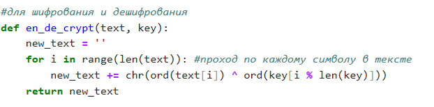
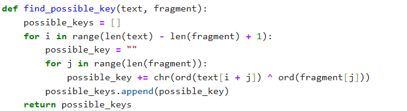
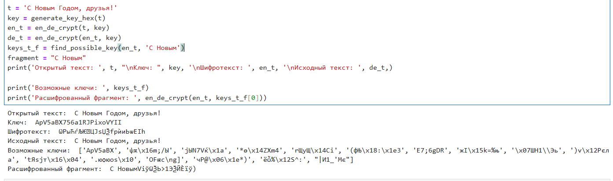

---
## Front matter
lang: ru-RU
title: Лабораторная работа №7
subtitle: Основы информационной безопасности
author:
  - Мурашов И. В., НКАбд-03-23
institute:
  - Российский университет дружбы народов, Москва, Россия
  
date: 16 мая 2025

## i18n babel
babel-lang: russian
babel-otherlangs: english

## Formatting pdf
toc: false
toc-title: Содержание
slide_level: 2
aspectratio: 169
section-titles: true
theme: metropolis
header-includes:
 - \metroset{progressbar=frametitle,sectionpage=progressbar,numbering=fraction}
 - '\makeatletter'
 - '\makeatother'
 
## Fonts
mainfont: PT Serif
romanfont: PT Serif
sansfont: PT Sans
monofont: PT Mono
mainfontoptions: Ligatures=TeX
romanfontoptions: Ligatures=TeX
sansfontoptions: Ligatures=TeX,Scale=MatchLowercase
monofontoptions: Scale=MatchLowercase,Scale=0.9
---

## Докладчик

:::::::::::::: {.columns align=center}
::: {.column width="70%"}

  * Мурашов Иван Вячеславович
  * Cтудент, 2 курс, группа НКАбд-03-23
  * Российский университет дружбы народов
  * [1132236018@rudn.ru](mailto:1132236018@rudn.ru)
  * <https://neve7mind.github.io>

:::
::: {.column width="30%"}

:::
::::::::::::::

## Цель

Освоить на практике применение режима однократного гаммирования

## Задание

Нужно подобрать ключ, чтобы получить сообщение «С Новым Годом,
друзья!». Требуется разработать приложение, позволяющее шифровать и
дешифровать данные в режиме однократного гаммирования. Приложение
должно:
1. Определить вид шифротекста при известном ключе и известном открытом тексте.
2. Определить ключ, с помощью которого шифротекст может быть преобразован в некоторый фрагмент текста, представляющий собой один из возможных вариантов прочтения открытого текста

## Выполнение лабораторной работы

Я выполнил лабораторную работа на языке программирования Python, листинг программы и результаты выполнения приведены в отчете.

## Выполнение лабораторной работы

Требуется разработать программу, позволяющее шифровать и дешифровать данные в режиме однократного гаммирования. Начнем с создания функции для генерации случайного ключа 

{#fig:001 width=70%}

## Выполнение лабораторной работы

Необходимо определить вид шифротекста при известном ключе и известном открытом тексте. Так как операция исключающего или отменяет сама себя, делаю одну функцю и для шифрования и для дешифрования текста 

{#fig:002 width=70%}

## Выполнение лабораторной работы

Нужно определить ключ, с помощью которого шифротекст может быть преобразован в некоторый фрагмент текста, представляющий собой один из возможных вариантов прочтения открытого текста. Для этого создаю функцию для нахождения возможных ключей для фрагмента текста.

{#fig:003 width=70%}

## Выполнение лабораторной работы

Проверка работы всех функций. Шифрование и дешифрование происходит верно, как и нахождение ключей, с помощью которых можно расшифровать верно только кусок текста 

{#fig:004 width=70%}

## Вывод

В ходе выполнения данной лабораторной работы я освоил на практике применение режима однократного гаммирования.

