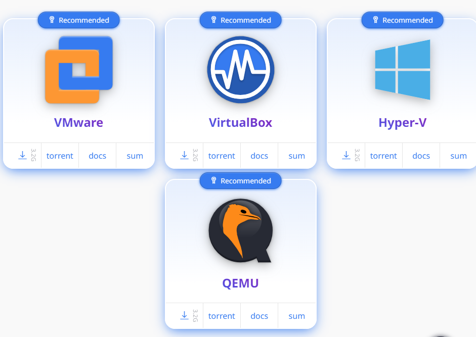
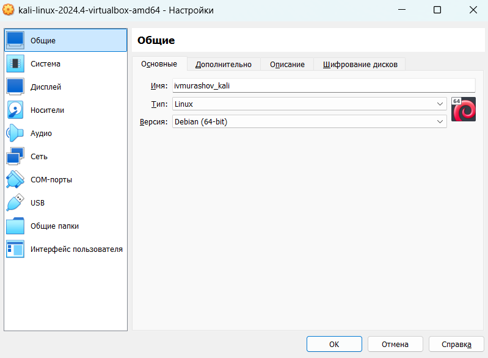
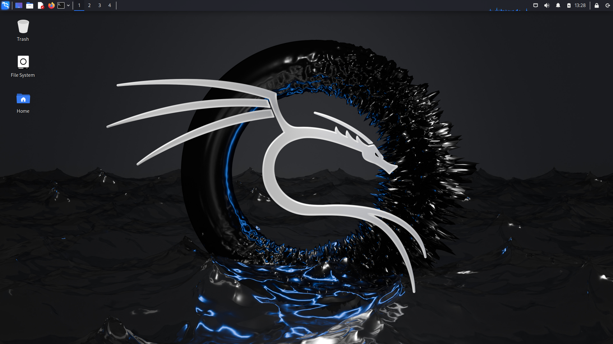
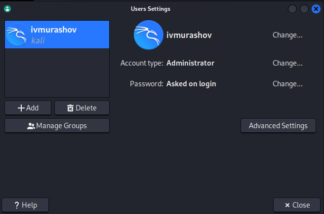
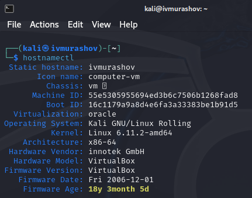

---
## Front matter
lang: ru-RU
title: Отчёт по этапу №1 индивидуального проекта
subtitle: Основы информационной безопасности
author:
  - Мурашов И. В., НКАбд-03-23
institute:
  - Российский университет дружбы народов, Москва, Россия
  
date: 7 марта 2025

## i18n babel
babel-lang: russian
babel-otherlangs: english

## Formatting pdf
toc: false
toc-title: Содержание
slide_level: 2
aspectratio: 169
section-titles: true
theme: metropolis
header-includes:
 - \metroset{progressbar=frametitle,sectionpage=progressbar,numbering=fraction}
 - '\makeatletter'
 - '\makeatother'
 
## Fonts
mainfont: PT Serif
romanfont: PT Serif
sansfont: PT Sans
monofont: PT Mono
mainfontoptions: Ligatures=TeX
romanfontoptions: Ligatures=TeX
sansfontoptions: Ligatures=TeX,Scale=MatchLowercase
monofontoptions: Scale=MatchLowercase,Scale=0.9
---

## Докладчик

:::::::::::::: {.columns align=center}
::: {.column width="70%"}

  * Мурашов Иван Вячеславович
  * Cтудент, 2 курс, группа НКАбд-03-23
  * Российский университет дружбы народов
  * [1132236018@rudn.ru](mailto:1132236018@rudn.ru)
  * <https://neve7mind.github.io>

:::
::: {.column width="30%"}

:::
::::::::::::::

## Цель работы

Целью данной работы является приобретени практических навыков по установке операционной системы Linux на виртуальную машину.

## Выполнение лабораторной работы

Загружаю с официального сайта [сборку виртуальной машины на базе Kali Linux](https://www.kali.org/get-kali/#kali-virtual-machines).

## Выполнение лабораторной работы

Выставляю базовые настройки: размер основной памяти 5120 Мб и 5 ядер процессора, двунаправленный буфер обмена, 48 Мб видеопамяти, остальные настройки были подхвачены автоматически.

## Выполнение лабораторной работы

Запускаю систему, удивительно, но она больше ничего не затребовала, кроме логина и пароля. Кто говорит, что логин - "root", а пароль - "toor" не знает, о чём говорит. Дефольно они: "kali", "kali" соответственно.

## Выполнение лабораторной работы

В настройках меняю имя пользователя, даю доступ к руту, меняю пароль. Так же советую изменить hostname ручками в консоли.

## Выполнение лабораторной работы

Просматриваю корректность данных после перезагрузки системы.

Аналогичным образом, в настройках добавляется русская раскладка и всё, что вашей душеньке угодно.

## Выводы

В ходе данной лабораторной работы я приобрёл практические навыки установки операционной системы Linux на виртуальную машину.

