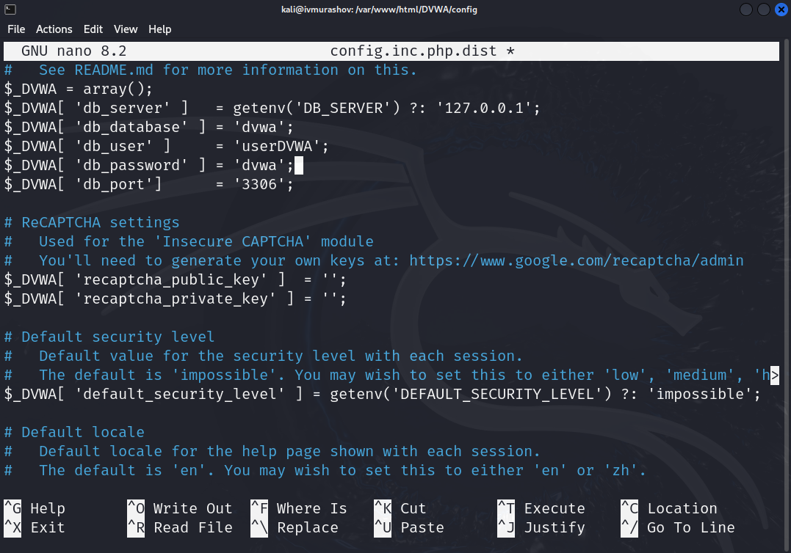

---
## Front matter
lang: ru-RU
title: Отчёт по этапу №2 индивидуального проекта
subtitle: Основы информационной безопасности
author:
  - Мурашов И. В., НКАбд-03-23
institute:
  - Российский университет дружбы народов, Москва, Россия
  
date: 22 марта 2025

## i18n babel
babel-lang: russian
babel-otherlangs: english

## Formatting pdf
toc: false
toc-title: Содержание
slide_level: 2
aspectratio: 169
section-titles: true
theme: metropolis
header-includes:
 - \metroset{progressbar=frametitle,sectionpage=progressbar,numbering=fraction}
 - '\makeatletter'
 - '\makeatother'
 
## Fonts
mainfont: PT Serif
romanfont: PT Serif
sansfont: PT Sans
monofont: PT Mono
mainfontoptions: Ligatures=TeX
romanfontoptions: Ligatures=TeX
sansfontoptions: Ligatures=TeX,Scale=MatchLowercase
monofontoptions: Scale=MatchLowercase,Scale=0.9
---

## Докладчик

:::::::::::::: {.columns align=center}
::: {.column width="70%"}

  * Мурашов Иван Вячеславович
  * Cтудент, 2 курс, группа НКАбд-03-23
  * Российский университет дружбы народов
  * [1132236018@rudn.ru](mailto:1132236018@rudn.ru)
  * <https://neve7mind.github.io>

:::
::: {.column width="30%"}

:::
::::::::::::::

## Цель работы

Приобретение практических навыков по установке DVWA.

## Выполнение лабораторной работы

Настройка DVWA происходит на нашем локальном хосте, поэтому нужно перейти в директорию `/var/www/html`. Затем клонирую нужный репозиторий GitHub (рис. 1).

## Выполнение лабораторной работы

Проверяю, что файлы склонировались правильно, далее повышаю права доступа к этой папке до 777 (рис. 2.)

## Выполнение лабораторной работы

Чтобы настроить DVWA, нужно перейти в каталог `/dvwa/config`, затем проверяю содержимое каталога (рис. 3)

## Выполнение лабораторной работы

Создаем копию файла, используемого для настройки DVWA `config.inc.php.dist` с именем `config.inc.php`. Копируем файл, а не изменяем его, чтобы у нас был запасной вариант, если что-то пойдет не так (рис. 4)

## Выполнение лабораторной работы

Далее открываю файл в текстовом редакторе (рис. 5)

## Выполнение лабораторной работы

Изменяю данные об имени пользователя и пароле (рис. 6)

## Выполнение лабораторной работы

По умолчанию в Kali Linux установлен mysql, поэтому можно его запустить без предварительного скачивания, далее выполняю проверку, запущен ли процесс (рис. 7)

## Выполнение лабораторной работы

Авторизируюсь в базе данных от имени пользователя root. Появляется командная строка с приглашением "MariaDB", далее создаем в ней нового пользователя, используя учетные данные из файла config.inc.php (рис. 8)

## Выполнение лабораторной работы

Теперь нужно пользователю предоставить привилегии для работы с этой базой данных (рис. 9)

## Выполнение лабораторной работы

Необходимо настроить сервер apache2, перехожу в соответствующую директорию (рис. 10)

## Выполнение лабораторной работы

В файле `php.ini` нужно будет изменить один параметр, поэтому открываю файл в текстовом редакторе (рис. 11)

## Выполнение лабораторной работы

В файле параметры allow_url_fopen и allow_url_include должны быть поставлены как `On` (рис. 12)

## Выполнение лабораторной работы

Запускаем службу веб-сервера apache и проверяем, запущена ли служба (рис. 13)

Мы настроили DVWA, Apache и базу данных, поэтому открываем браузер и запускаем веб-приложение, введя 127.0.0/DVWA (рис. 14)

## Выполнение лабораторной работы

Прокручиваем страницу вниз и нажимем на кнопку `create\reset database` (рис. 15)

## Выполнение лабораторной работы

Авторизуюсь с помощью предложенных по умолчанию данных (рис. 16)

## Выполнение лабораторной работы

Оказываюсь на домшней странице веб-приложения, на этом установка окончена (рис. 17)

## Выводы

Приобретены практические навыки по установке уязвимого веб-приложения DVWA.

