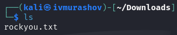
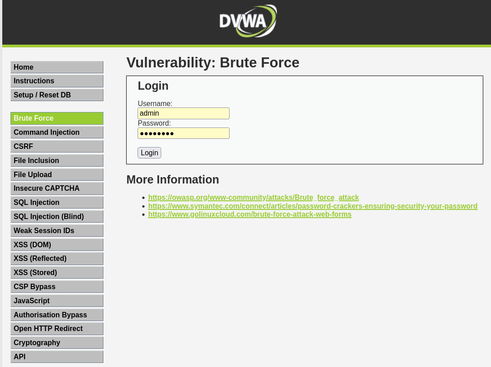
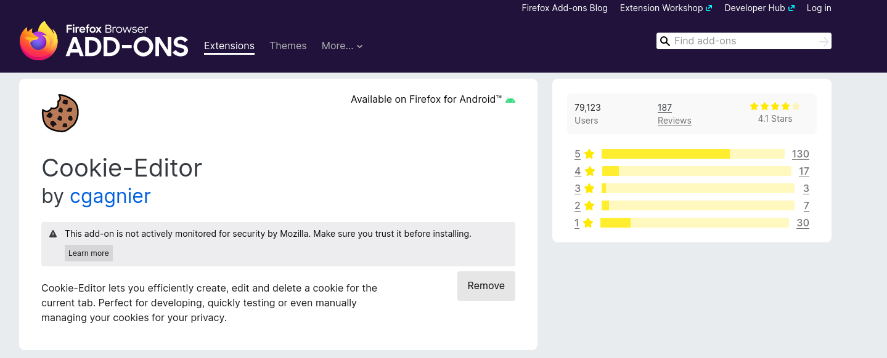
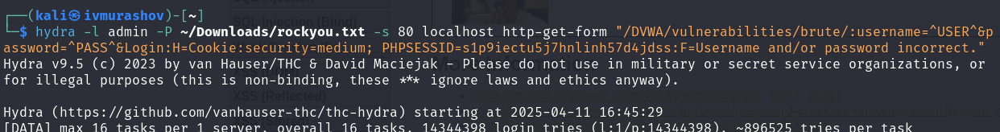
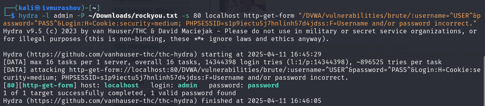
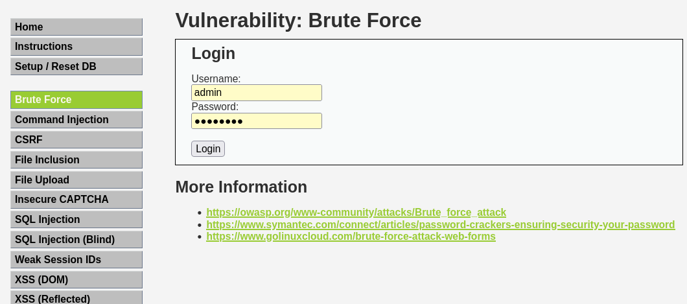
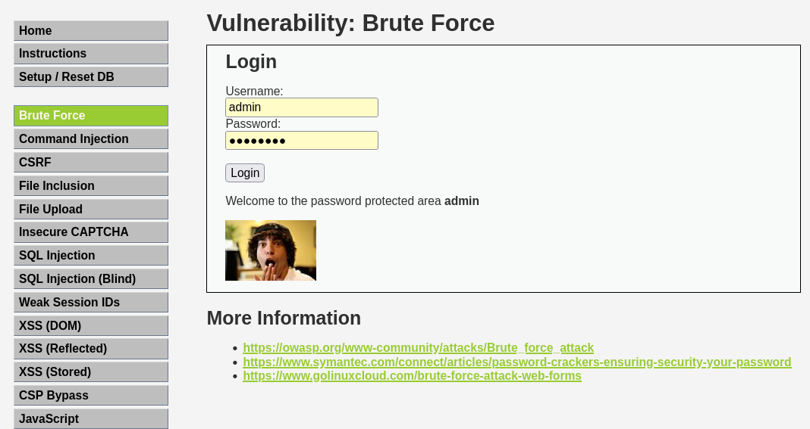

---
## Front matter
lang: ru-RU
title: Отчёт по этапу №3 индивидуального проекта
subtitle: Основы информационной безопасности
author:
  - Мурашов И. В., НКАбд-03-23
institute:
  - Российский университет дружбы народов, Москва, Россия
  
date: 11 апреля 2025

## i18n babel
babel-lang: russian
babel-otherlangs: english

## Formatting pdf
toc: false
toc-title: Содержание
slide_level: 2
aspectratio: 169
section-titles: true
theme: metropolis
header-includes:
 - \metroset{progressbar=frametitle,sectionpage=progressbar,numbering=fraction}
 - '\makeatletter'
 - '\makeatother'
 
## Fonts
mainfont: PT Serif
romanfont: PT Serif
sansfont: PT Sans
monofont: PT Mono
mainfontoptions: Ligatures=TeX
romanfontoptions: Ligatures=TeX
sansfontoptions: Ligatures=TeX,Scale=MatchLowercase
monofontoptions: Scale=MatchLowercase,Scale=0.9
---

## Докладчик

:::::::::::::: {.columns align=center}
::: {.column width="70%"}

  * Мурашов Иван Вячеславович
  * Cтудент, 2 курс, группа НКАбд-03-23
  * Российский университет дружбы народов
  * [1132236018@rudn.ru](mailto:1132236018@rudn.ru)
  * <https://neve7mind.github.io>

:::
::: {.column width="30%"}

:::
::::::::::::::

## Цель работы

Приобретение практических навыков по использованию инструмента Hydra для брутфорса паролей.

## Задание

Реализовать эксплуатацию уязвимости с помощью брутфорса паролей.

## Выполнение лабораторной работы

 Чтобы пробрутфорсить пароль, нужно сначала найти большой список частоиспользуемых паролей. Его можно найти в открытых источниках, я взяла стандартный список паролей `rockyou.txt` для kali linux (рис. 1).

## Выполнение лабораторной работы

Захожу на сайт DVWA, полученный в ходе предыдущего этапа проекта. Для запроса hydra мне понадобятся параметры cookie с этого сайта (рис. 2).
 

## Выполнение лабораторной работы

Чтобы получить информацию о параметрах cookie я установил соответствующее расширение для браузера [@cookies], теперь могу не только увидеть параметры cookie, но и скопировать их (рис. 3).

## Выполнение лабораторной работы

Ввожу в Hydra запрос нужную информацию. Пароль будем подбирать для пользователя admin, используем GET-запрос с двумя параметрами cookie: безопасность и PHPSESSID, найденными в прошлом пункте (рис. 4).

## Выполнение лабораторной работы

Спустя некоторое время в результат запроса появится результат с подходящим паролем (рис. 5).

## Выполнение лабораторной работы

Вводим полученные данные на сайт для проверки (рис. 6).

## Выполнение лабораторной работы

Получаем положительный результат проверки пароля. Все сделано верно (рис. 7).

## Выводы

Приобрел практические навыки по использованию инструмента Hydra для брутфорса паролей.

